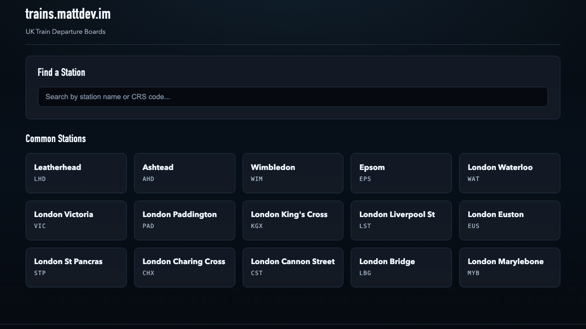
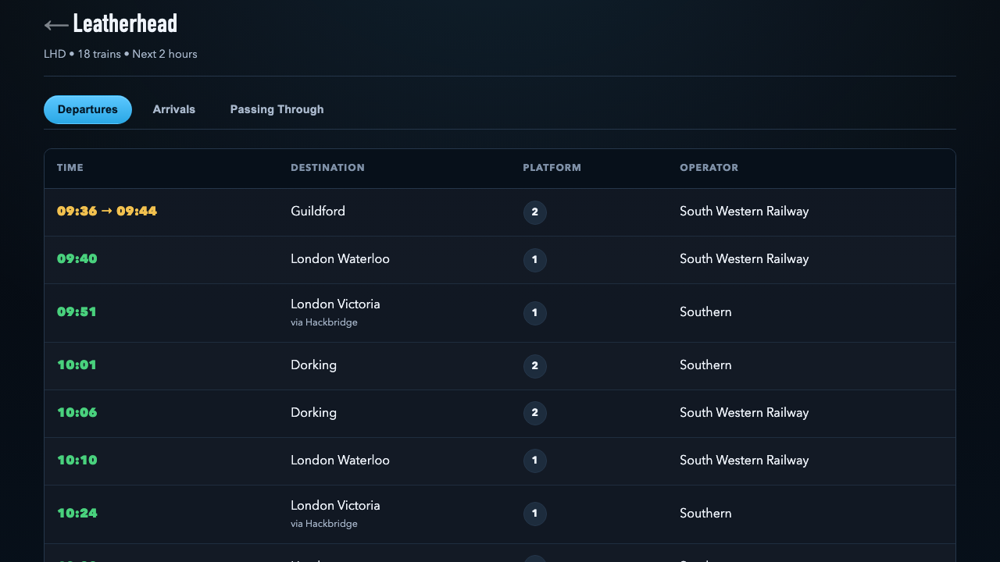

# Leatherhead Live - Train Board Web App

A FastAPI-powered web app for UK National Rail and TfL (Tube/Overground/DLR) live departure and arrival boards, with JSON API routes supporting the UI.

## Features

- Fast async API + web UI (FastAPI + httpx)
- Provider support: National Rail + TfL (Tube, Overground, DLR)
- Unified station search across NR + TfL
- TfL board UX grouped by line with line status summaries
- Service route detail views for NR and TfL
- Configurable caching backend (`memory` or `sqlite`)
- Cache-busted static assets tied to git commit

## Screenshots

### Homepage


### TfL Departures Board


### TfL Service Detail


## Project Structure

```text
LeatherheadLive/
├── app/
│   ├── main.py                    # FastAPI app setup, middleware, health
│   ├── config.py                  # Settings and env/file key loading
│   ├── models/
│   │   ├── board.py               # National Rail models
│   │   ├── tfl.py                 # TfL board/prediction models
│   │   └── tfl_service.py         # TfL service detail models
│   ├── routers/
│   │   ├── boards.py              # JSON API endpoints
│   │   ├── pages.py               # HTML routes and HTMX partial routes
│   │   └── stations.py            # Station autocomplete endpoint
│   ├── services/
│   │   ├── rail_api.py            # National Rail API client
│   │   ├── tfl_api.py             # TfL API client
│   │   ├── station_search.py      # Unified local station search
│   │   └── display_mapper.py      # UI mapping/grouping helpers
│   ├── tools/
│   │   └── refresh_tfl_stations.py # Manual TfL station index refresh command
│   ├── middleware/
│   │   └── cache.py               # Cache backend abstraction
│   ├── templates/                 # Jinja templates + HTMX partials
│   └── static/                    # CSS/JS/icons/data
├── app/static/data/stations.json  # National Rail station index
├── app/static/data/tfl_stations.json # TfL local station index (generated)
├── requirements.txt
├── .env.example
└── README.md
```

## Installation

### Prerequisites

- Python 3.10+
- Virtual environment (recommended)
- National Rail API key (https://www.nationalrail.co.uk/100296.aspx)
- TfL API key (https://api-portal.tfl.gov.uk/)

### Setup

1. Create and activate virtual environment:
   ```bash
   python3 -m venv .venv
   source .venv/bin/activate
   ```

2. Install dependencies:
   ```bash
   pip install -r requirements.txt
   ```

3. Configure API keys:
   ```bash
   cp .env.example .env
   # Set RAIL_API_KEY and TFL_APP_KEY (or TFL_API_KEY)
   ```

   File-based key fallback is also supported:
   - `key` for National Rail
   - `tfl_key` for TfL

4. Refresh local TfL station index (recommended before deploys):
   ```bash
   python -m app.tools.refresh_tfl_stations
   ```
   This writes `app/static/data/tfl_stations.json`, used by `/api/stations/search` for fast local TfL autocomplete.

## Running the Server

```bash
uvicorn app.main:app --reload --host 0.0.0.0 --port 8000
```

Server: [http://localhost:8000](http://localhost:8000)

## API Endpoints

### Docs

- Swagger UI: [http://localhost:8000/docs](http://localhost:8000/docs)
- ReDoc: [http://localhost:8000/redoc](http://localhost:8000/redoc)

### National Rail (JSON)

Compatibility routes:
- `GET /api/boards/{crs_code}` (full board)
- `GET /api/boards/{crs_code}/departures`
- `GET /api/boards/{crs_code}/arrivals`
- `GET /api/boards/{crs_code}/passing`

Provider-prefixed routes:
- `GET /api/boards/nr/{crs_code}` (full board)

Cache control:
- `DELETE /api/boards/{crs_code}/cache`
- `DELETE /api/boards/cache/all`

Examples:
```bash
curl http://localhost:8000/api/boards/LHD
curl http://localhost:8000/api/boards/nr/LHD
curl http://localhost:8000/api/boards/LHD/departures
```

### TfL (JSON)

- `GET /api/boards/tfl/{stop_point_id}` (full board)
- `GET /api/boards/tfl/{stop_point_id}/departures`
- `GET /api/boards/tfl/{stop_point_id}/arrivals`
- `GET /api/boards/tfl/{stop_point_id}/status`
- `GET /api/boards/tfl/{stop_point_id}/passing` -> returns `404` (unsupported)

Example:
```bash
curl http://localhost:8000/api/boards/tfl/940GZZLUWSM
```

### Health

- `GET /api/health`

Example:
```bash
curl http://localhost:8000/api/health
```

### Query Parameters

Board endpoints support:
- `use_cache` (`true` by default)

Example:
```bash
curl "http://localhost:8000/api/boards/LHD?use_cache=false"
```

## Web Routes

### Board pages

- `GET /board/nr/{crs}/{view}` where `view` is `departures|arrivals|passing`
- `GET /board/tfl/{stop_point_id}/{view}` where `view` is `departures|arrivals`

Legacy redirects (NR compatibility):
- `GET /board/{crs}` -> `/board/nr/{crs}/departures`
- `GET /board/{crs}/{view}` -> `/board/nr/{crs}/{view}`

HTMX content/refresh routes are also exposed for board tabs and auto-refresh.

### Service detail pages

- NR: `GET /service/{crs}/{service_id}`
- TfL: `GET /service/tfl/{line_id}/{from_stop_id}/{to_stop_id}`

## Station Search

- Endpoint: `GET /api/stations/search`
- Returns: HTML fragment (HTMX partial), not JSON
- Uses local indices:
  - NR: `app/static/data/stations.json`
  - TfL: `app/static/data/tfl_stations.json`
- Unified ranking across providers with provider-aware board URLs

## TfL Scope / Limitations

- Supported modes: `tube`, `overground`, `dlr`
- TfL `passing` board view is not supported (`404`)
- TfL service route detail is best-effort from live predictions/route sequence/timetable data

## Configuration

Configuration can be set via environment variables or `.env`:

```env
# National Rail API
RAIL_API_KEY=your_api_key_here

# TfL API
TFL_APP_KEY=your_tfl_app_key_here
TFL_APP_ID=
TFL_MODES=["tube","overground","dlr"]

# Cache
CACHE_TTL_SECONDS=60
CACHE_BACKEND=memory
# CACHE_BACKEND=sqlite
# CACHE_SQLITE_PATH=/tmp/trains_mattdev_im_cache.sqlite3

# CORS
CORS_ORIGINS=["*"]

# App
APP_NAME="Leatherhead Live Train Board API"
DEBUG=false
```

## Caching Strategy

- Default TTL: `60` seconds
- Backend: configurable (`memory` or `sqlite`)
- Cached domains: National Rail boards, TfL board/status/search snapshots, and derived board page data paths
- Manual invalidation endpoints exist for NR board cache routes

## Error Handling

Common status behavior:
- `200 OK`: success
- `404 Not Found`: invalid code/id, unavailable resource, or unsupported TfL passing view
- `5xx`: upstream/provider or internal server issues

## Development

### Run tests

```bash
pytest
```

### Core modules

- Models: `app/models/`
- Services: `app/services/`
- Routers: `app/routers/`
- Templates: `app/templates/`
- Config: `app/config.py`

## License

GNU Affero General Public License v3.0 (AGPL-3.0). See [LICENSE](LICENSE).

## Credits

Built with:
- [FastAPI](https://fastapi.tiangolo.com/)
- [Pydantic](https://pydantic-docs.helpmanual.io/)
- [HTTPX](https://www.python-httpx.org/)
- [Uvicorn](https://www.uvicorn.org/)
- National Rail API
- TfL Unified API
